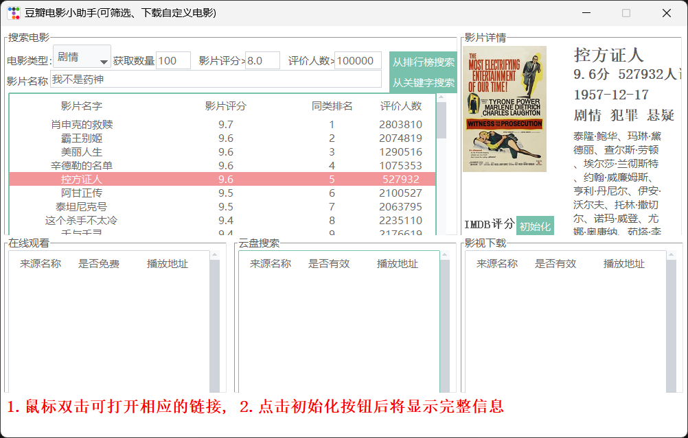

# douban-helper

## 项目简介

通过从排行榜和从影片关键词两种方式爬取电影数据，了解电影的评分、简介等基本内容。

## 功能截图

## 包含功能

- [x] 根据关键字搜索电影
- [x] 根据排行榜(TOP250)搜索电影
- [x] 显示IMDB评分及其他基本信息
- [x] 提供多个在线视频站点，无需vip
- [x] 提供多个云盘站点搜索该视频，以便保存到云盘
- [x] 提供多个站点下载该视频